Two benefits in one go! Testing out Mermaid rendering and delivering the value proposition in a standardised value realisation chart was added to the site. 

See the diagram below:

### 📈 Value realisation diagram

```mermaid
 flowchart TD
  subgraph Legend[" "]
    direction LR
        L1["🔵 Drivkræfter"]
        L2["🟢 Ændringer"]
        L3["🟠 Fordele"]
        L4["🟣 Værdier"]
  end

  subgraph Content[" "]
        B1["Markdown-baseret indholdsstyring"]
        B2["Versionsstyring og samarbejde"]
        A1["GitHub som fælles kilde"]
        B3["Automatiseret site-generering"]
        B4["Indførelse af løskoblet arkitektur"]
        A2["Statisk sidegenerator"]
        B5["Automatiseret udrulning"]
        A3["CI/CD pipeline"]
        B6["Skift til statisk hosting og CDN"]
        A4["Statisk site generering - SSG"]
        C1["Lettere opdatering af indhold"]
        C2["Gennemsigtig ændringshistorik"]
        C3["Reduceret manuelt arbejde"]
        C4["Styrket exit-strategi og teknologisk uafhængighed"]
        C5["Hurtigere publicering"]
        C6["Hurtigere indlæsning og bedre SEO"]
        D1["Ansvarlig brug af offentlige midler"]
        D3["Vækst i open source-økosystemet"]
        D4["Digital suverænitet"]
        D2["Øget offentlig værdi"]
        D5["Interoperabilitet og samarbejde"]
  end

    A1 --> B1 & B2
    A2 --> B3 & B4
    A3 --> B5
    A4 --> B6
    B1 --> C1
    B2 --> C2
    B3 --> C3
    B4 --> C4
    B5 --> C5
    B6 --> C6
    C1 --> D1 & D3
    C2 --> D1 & D4 & D3
    C3 --> D1
    C4 --> D2 & D5 & D4
    C5 --> D2
    C6 --> D2

     L1:::enabler
     L2:::change
     L3:::benefit
     L4:::value
     A1:::enabler
     B1:::change
     B2:::change
     A2:::enabler
     B3:::change
     B4:::change
     A3:::enabler
     B5:::change
     A4:::enabler
     B6:::change
     C1:::benefit
     C2:::benefit
     C3:::benefit
     C4:::benefit
     C5:::benefit
     C6:::benefit
     D1:::value
     D3:::value
     D4:::value
     D2:::value
     D5:::value

    classDef enabler fill:#d0e6f7,stroke:#000,stroke-width:1px,color:#333
    classDef change fill:#e6f2d0,stroke:#000,stroke-width:1px,color:#333
    classDef benefit fill:#f7e6d0,stroke:#000,stroke-width:1px,color:#333
    classDef value fill:#ecd0f7,stroke:#000,stroke-width:1px,color:#333
    style Legend stroke:none
    style Content stroke:none 
```

